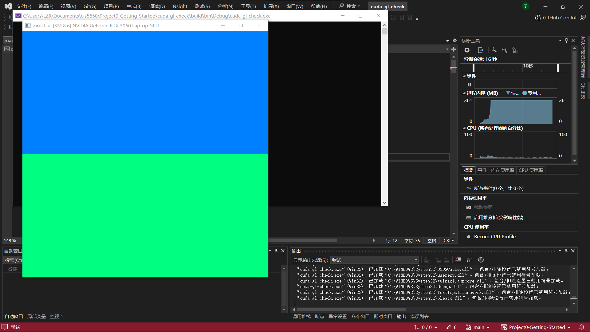
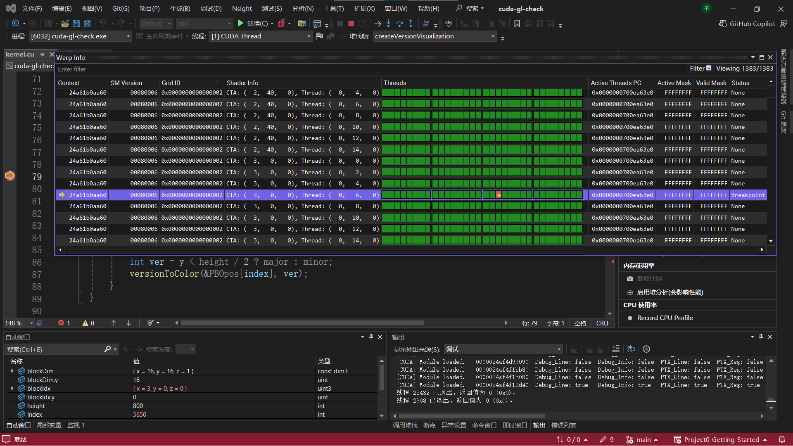
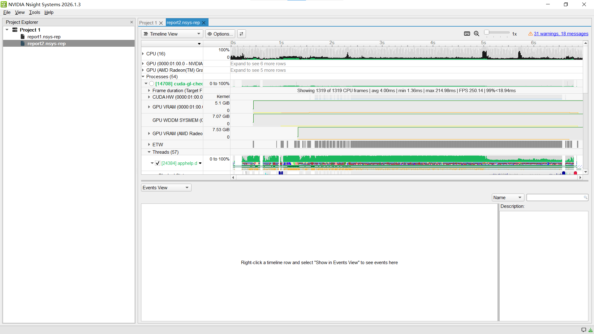
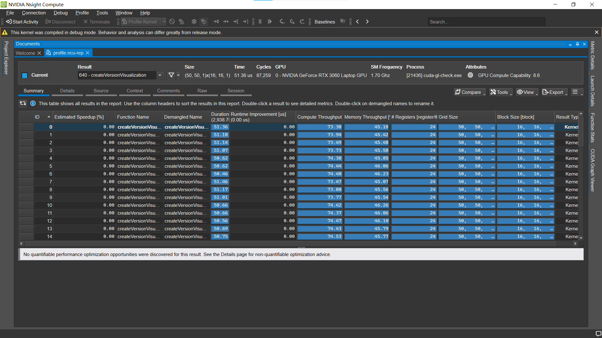
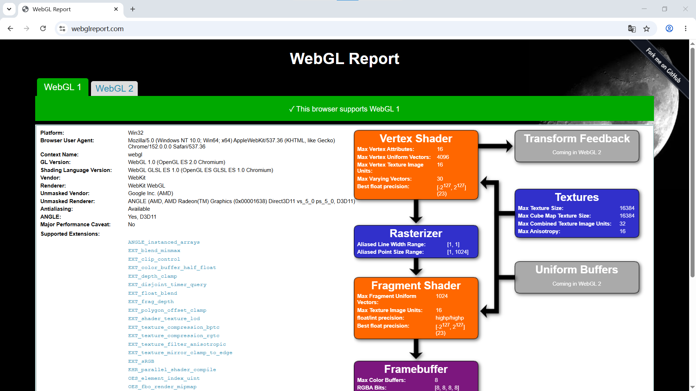
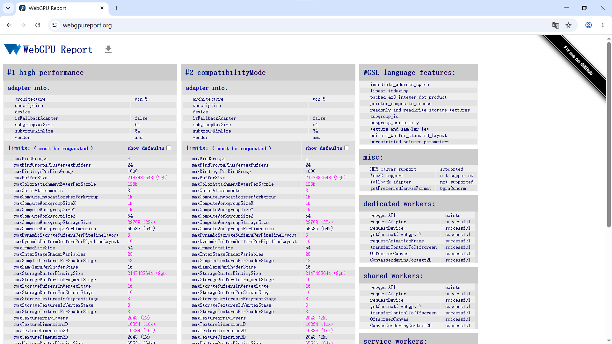

# Project 0 Getting Started

**University of Pennsylvania, CIS 5650: GPU Programming and Architecture, Project 0**

* Zirui Liu
* Tested on: Windows 10, NVIDIA GeForce RTX 3060 Laptop GPU, Compute Capability 8.6 (personal computer)

## CUDA GL Check

## Nsight Debugger

## Nsight Systems

## Nsight Compute

## WebGL

## WebGPU

