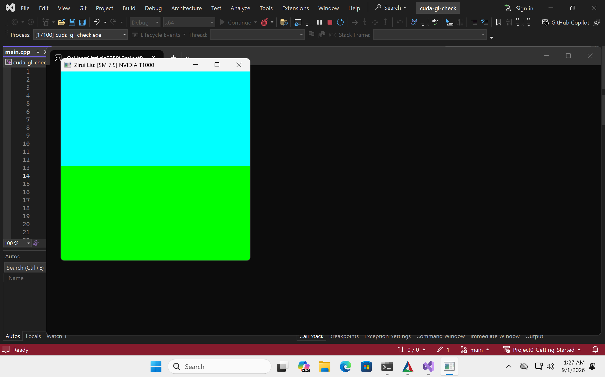
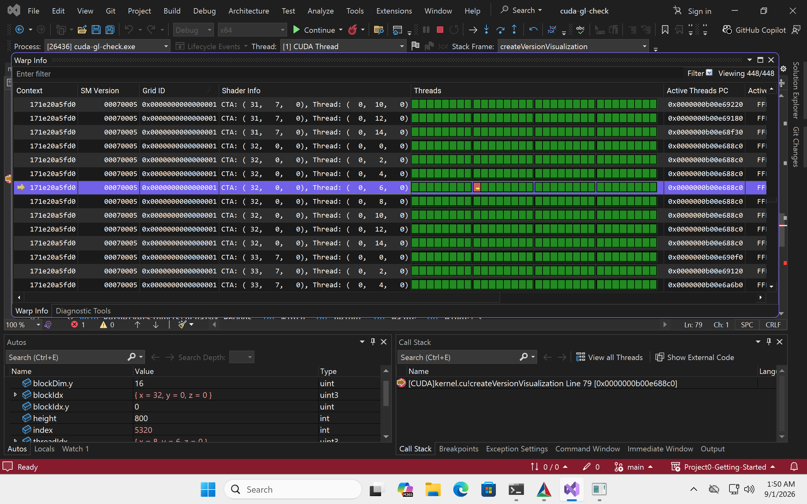
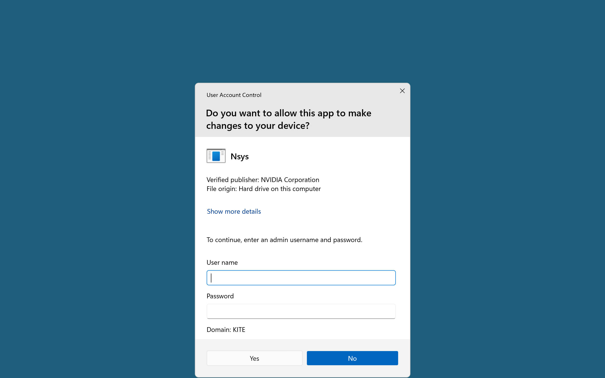
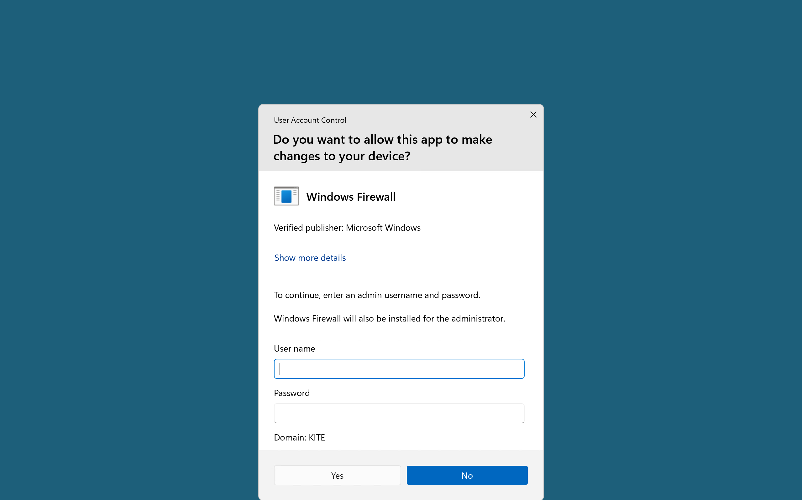
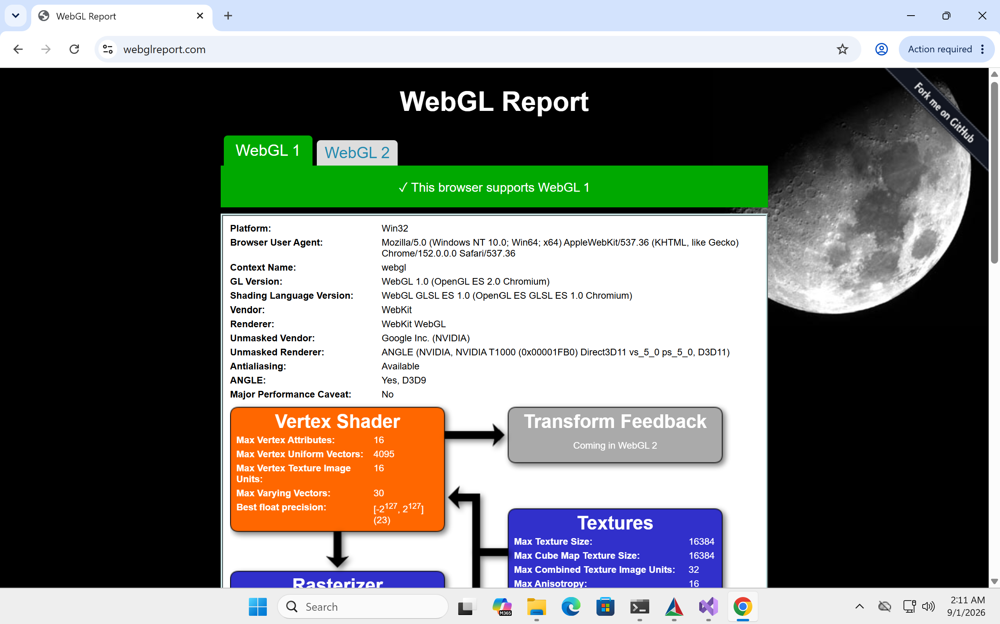
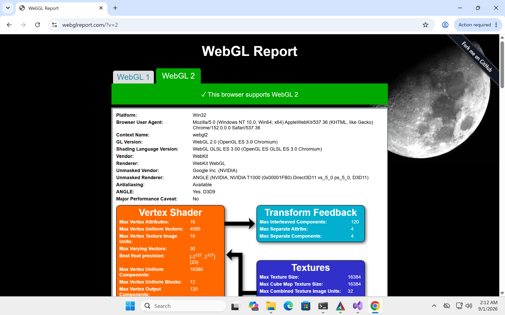
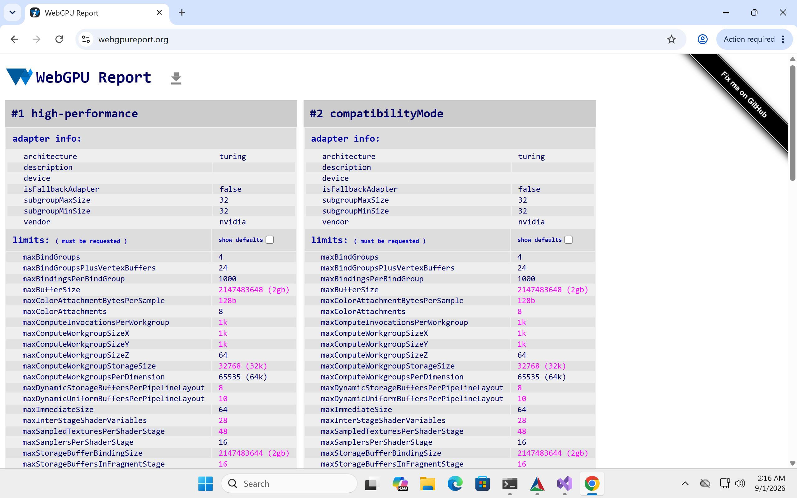

# Project 0 Getting Started

**University of Pennsylvania, CIS 5650: GPU Programming and Architecture, Project 0**

- Zirui Liu
- Tested on: Windows 11, NVIDIA T1000 4GB, Compute Capability 7.5 (CETS Virtual Lab computer)

## CUDA GL Check

## Nsight Debugger

## Nsight Systems

Nsight Systems required administrator access on the CETS computer.

## Nsight Compute

Nsight Compute required administrator access to change the firewall settings.

## WebGL

## WebGPU

